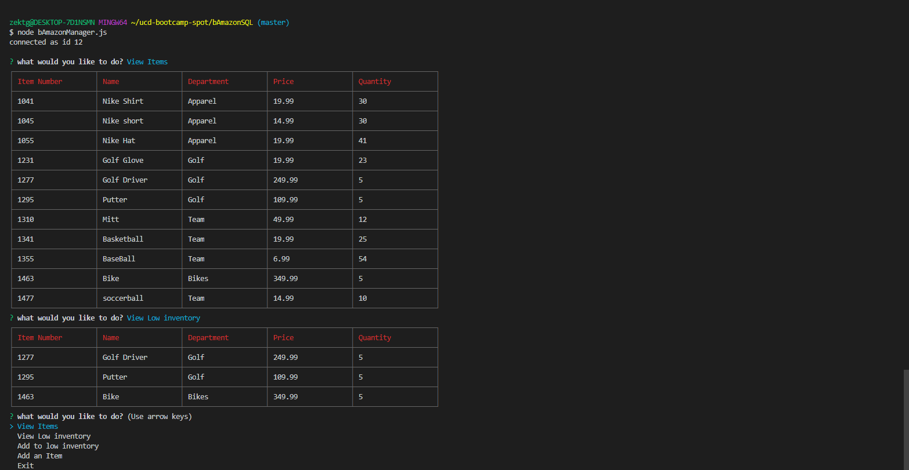
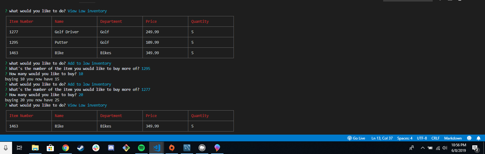
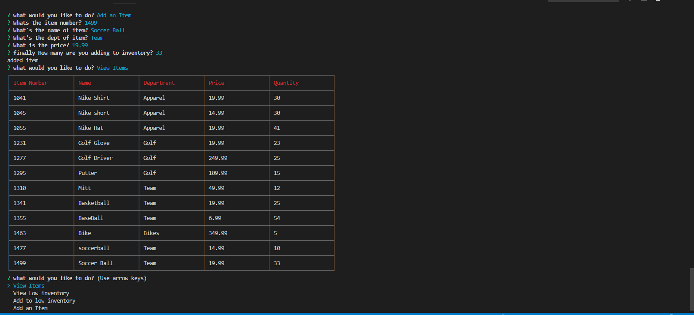

# bAmazonSQL
### an inventory managment app.

## The customer aplication
### will check a mySQL database then allow user to purchase items, If the quantity is less then the purchase amount it will let you know!

## The manager aplication
### will let you view inventory, see low inventory, purchase more inventory for low inventory items, and add items to stock.

#### the inventory viewer in action.

### low inventory updater and View.

### Adding an item to inventory.